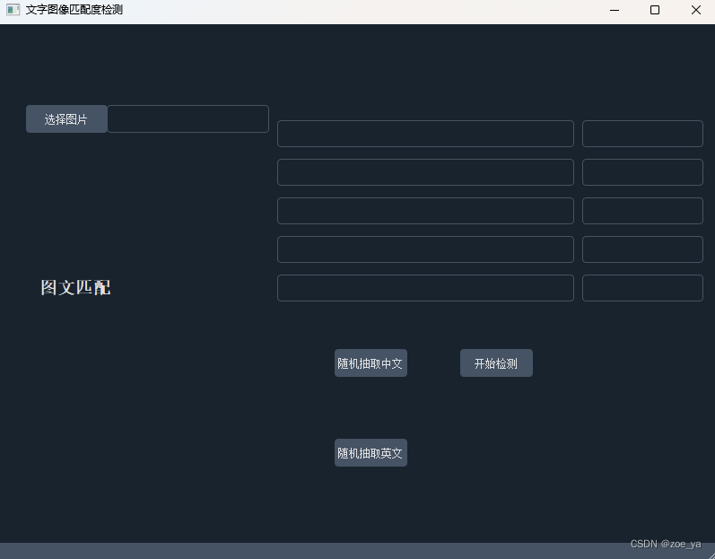
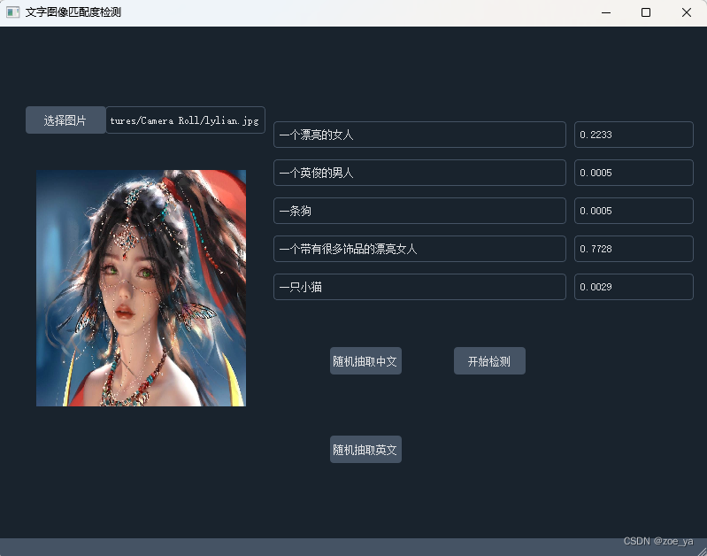

## 基于CLIP、Transformers实现图文匹配度检测软件

## 原理
- 使用**CLIP**（对比图文预训练方法）提供的图文匹配度检测接口
- 使用**huggingface**基于**Transformers**的机器模型实现离线翻译，因此输入中英文均可检测
- 前端图形用户界面使用**PYQT**开发,并使用了**qdarkstyle**进行优化

## 预览




## 安装
``` bash
pip install -r requirements.txt
```
## 说明
- 附带数据集来自flick和网上整理的，随机抽取的语句来自附带数据集，后续可对应这部分代码进行扩展
## 使用
- 左边一栏是候选文字语句，右边一栏是对应每条文字语句的匹配度（支持中英文）

- 点击选择图片，如为我代码中附带的数据集中的图片，那么右边第一列的第一行会附上这张图片的正确描述，
 如为其他图片，则可以手动输入正确描述，随机抽取中文、英文按钮会下后四行抽取干扰的中文、
英文描述，**所有候选的5个描述语句均可手动修改**。
- 更多请看：http://t.csdn.cn/hPkMt